# IaaS in your local machine

## How to create a VM

1. First you need to click on `New` to create a new virtual machine
   

2. Choose the following options in the `Name and Operating System` tab:
   - Name: `local-cloud`
   - Select the `ISO image` from your dowload folder
   - Select `Skip unattended Installation`
    
    

3. Choose the following options in the `Hardware` tab
   - Base Memory: `2048 MB`
   - Processors: `2`
    

4. Choose the following options in the `Hard Disk` tab
    - Hard Disk Size: `20 GB`
    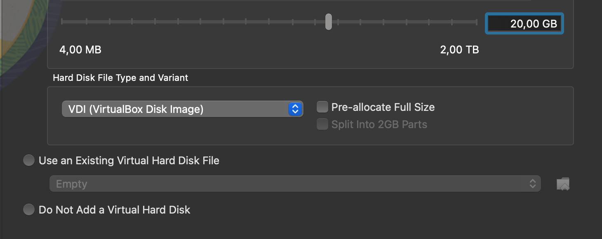

5. Select Finish and click over the newly created VM


## Configuration of your Ubuntu Server

1. Click on `Try or Install Ubuntu Server`
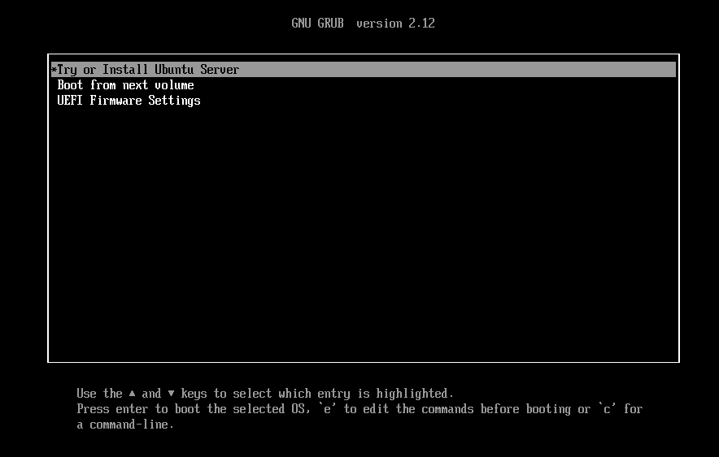

2. Select `Español` as the language and press enter in the next 2 windows
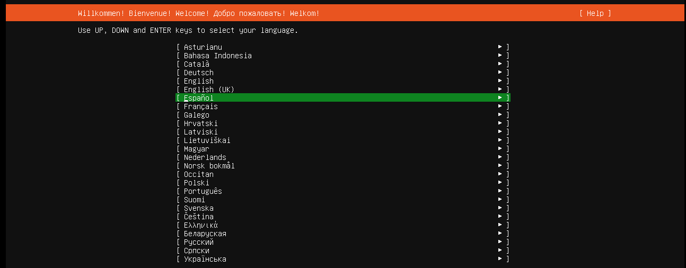
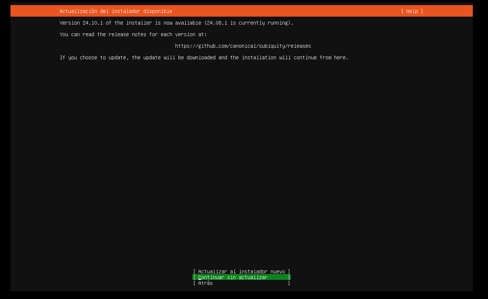
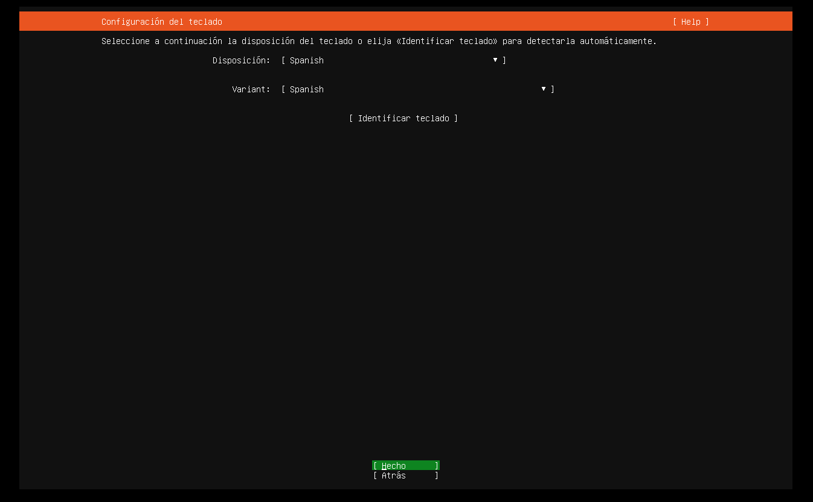

3. Select `Ubuntu Server` in the installation window and click `Hecho` in the next 3 windows
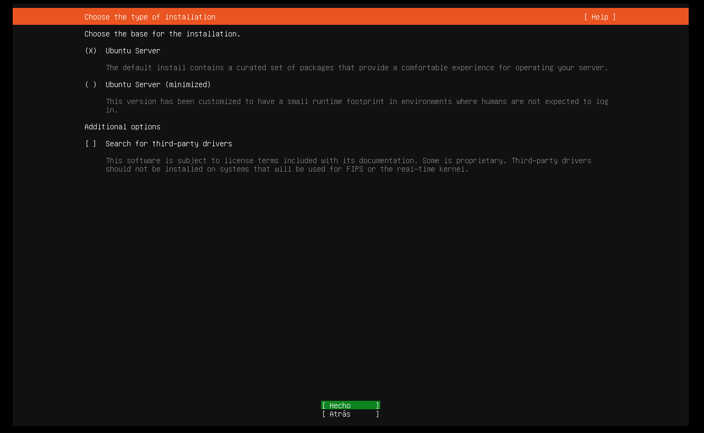

4. Scroll down in the `Storage layout` window until you can select `Hecho` and click again `Hecho` in the next window and `Continuar` in the pop-up that appears
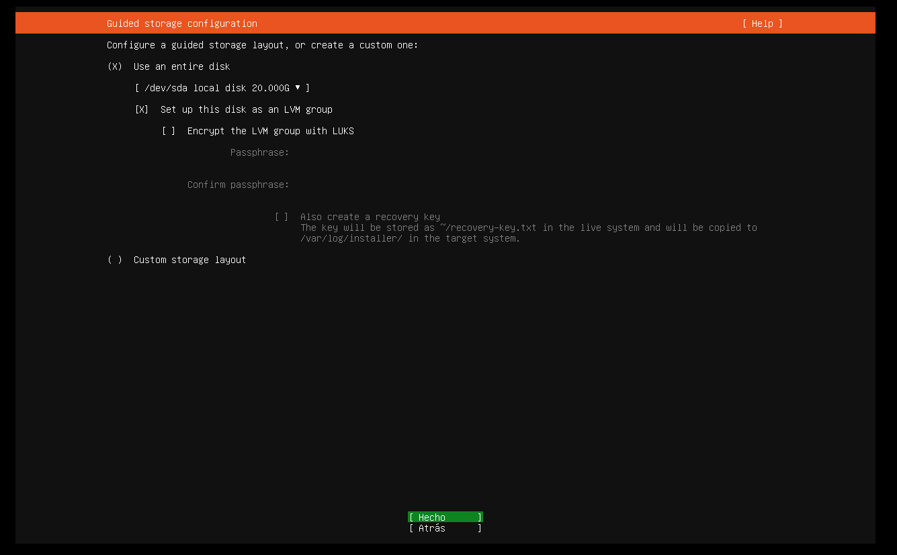

5. In the `Profile Configuration` window use the following configuration
   - Su nombre: `<edem-username>`
   - Your servers name: `<edem-username>-vm`
   - Elija su nombre de usuario: `<edem-username>`
   - Elija su contraseña: `edem2425`
    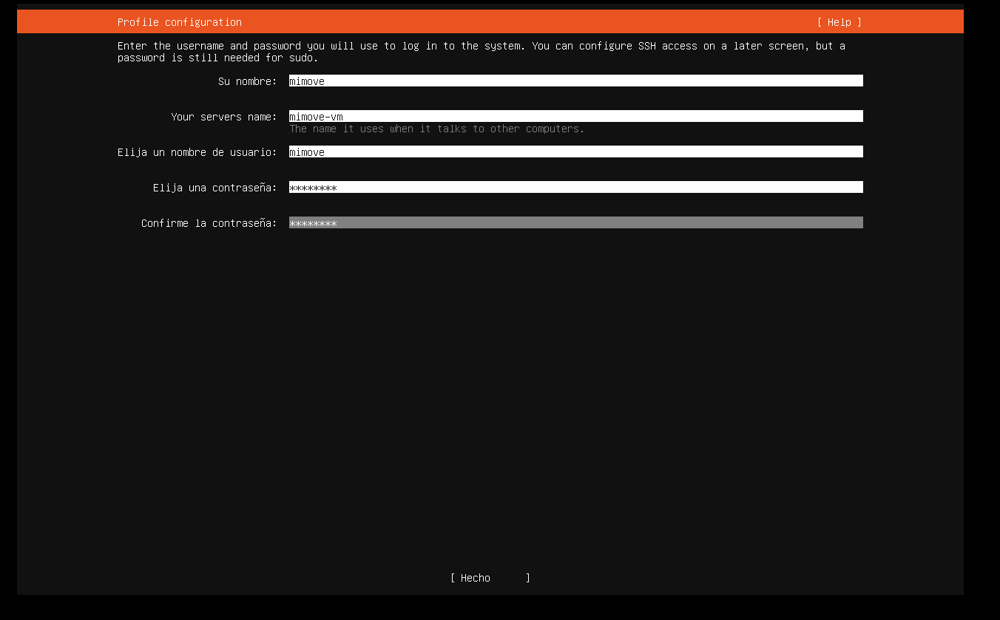

6. Skip the use of `Ubuntu Pro`

7. Make sure you select `Instalar servidor OpenSSH`
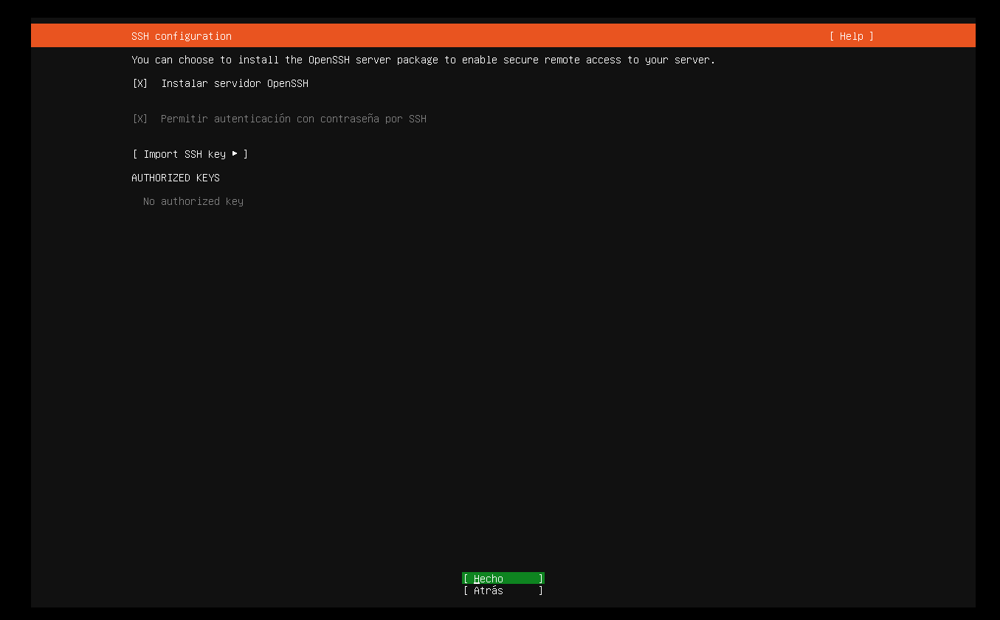

8. In the feature server snaps, select `docker` and the `stable` version
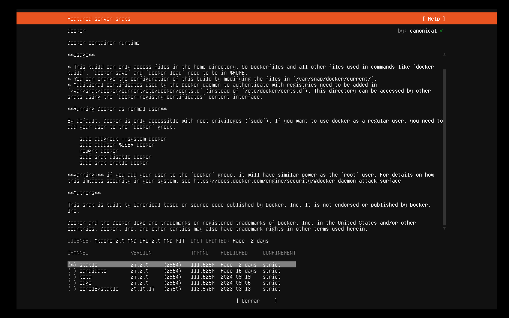
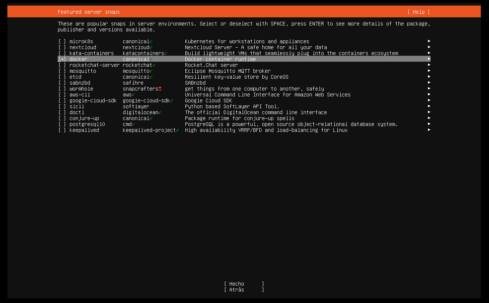

9. When everything is finished, click on `Reiniciar ahora`

10. If you seee a `[FAILED]` message, just press `ENTER`

11. Turn off the vm by righ-clicking on its name and the choose stop/power-off
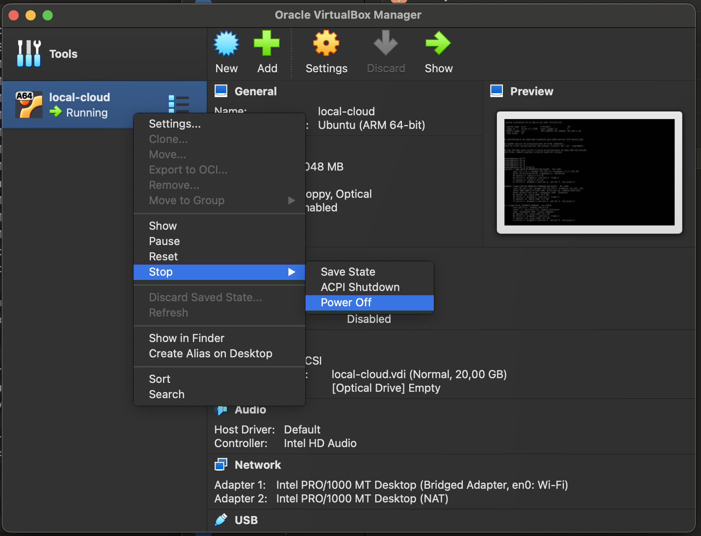

12. Select the `Bridged Adapter` from the Network tab
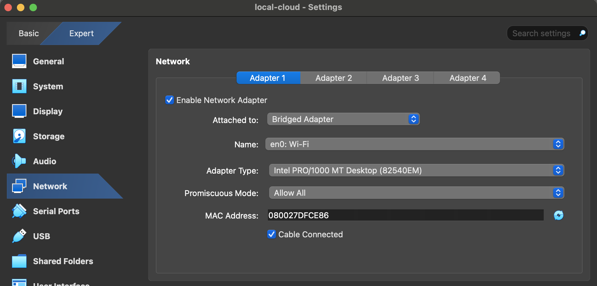

13. Start the vm

14. Run `ifconfig` in the terminal after logging in and search the inet address that starts with `192.168.1.xxx`


15.  Open a terminal in your laptop and run the following command

```sh
ssh <username>@192.168.1.<your-inet-address>
```

For example:
```sh
ssh mimove@192.168.1.143
```


16. To allow the use of docker copy and paste the following command in your newly open terminal

```sh
sudo chmod 777 /var/run/docker.sock
```

17. Now if you run `docker run hello-world` you should see the hello-world image being dowloaded and run in your vm

